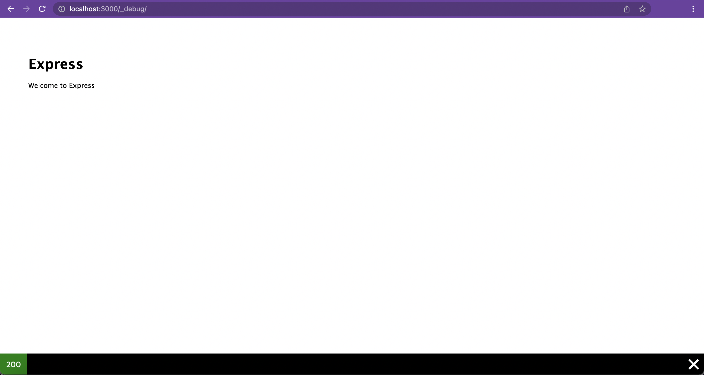
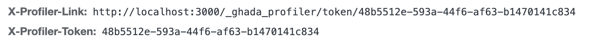
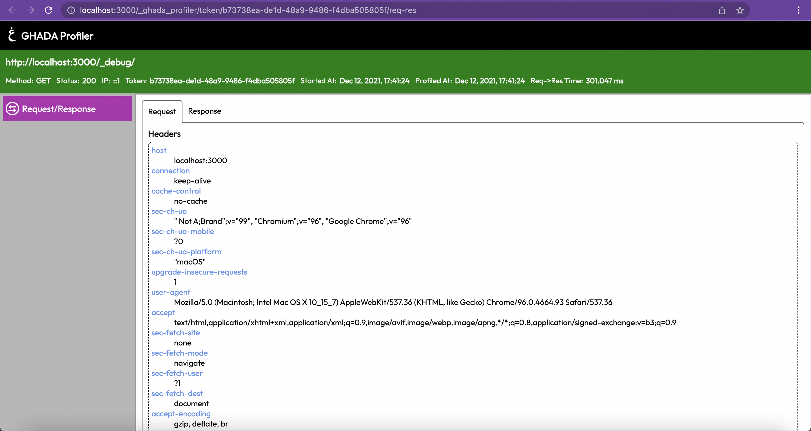
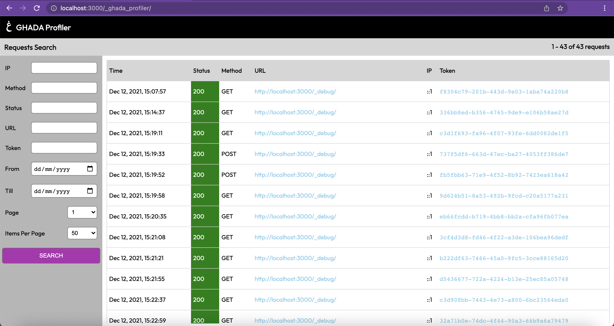

# Ghada Express Profiler

Ghada Express Profiler is inspired by [Symfony Profiler][URL_symfony].
Its main target is to make debugging easier for  applications built using [Express Node.js framework][URL_express].

## Works with

- `Express` version of `4`

## Dependencies

```json
"ejs": "^3.1.6",
"express": "^4.17.1",
"on-finished": "^2.3.0",
"response-time": "^2.3.2",
"sqlite3": "^5.0.2",
"uuid": "^8.3.2"
```

## Installation

Using npm

```sh
npm install @ghadautopia/express-profiler
```

Or using yarn

```sh
yarn add @ghadautopia/express-profiler
```

## Usage

Import `@ghadautopia/express-profiler` in your project. Instantiate it directly after mounting all the routes in the Express app and before the __404 and Error handlers__. As shown in the below example:

```javascript
// import express
const express = require('express');
// import profiler
const { profiler } = require('@ghadautopia/express-profiler');

// instantiating express app
const app = express();

// app routes
app.use('/', indexRouter);

// instantiating profiler - directly after mounting app routes
profiler(app);

// catch 404 and forward to error handler
app.use(function(req, res, next) {
  next(createError(404));
});

// error handler
app.use(function(err, req, res, next) {
  // set locals, only providing error in development
  res.locals.message = err.message;
  res.locals.error = req.app.get('env') === 'development' ? err : {};

  // render the error page
  res.status(err.status || 500);
  res.render('error');
});
```

## How it works

Ghada Express Profiler mainly depends on 2 concepts:

- __Streams__: responsible for logging the helpful data related to each request
- __Scopes__: responible for using the logged data by streams to render friendly views to be helpful in debugging the request and its response

Ghada Express Profiler uses sqlite to log the `Streams` data. The sqlite file is created in the project itself in the path `.cache/ghada/profiler.sqlite`.

In order to avoid logging collision between concurrent requests. Ghada Express Profiler forces the requests to be handled one by one. If a request is being processed, any other coming request will wait for the current one to finish.

To activate Ghada Express Profiler debugging on a current request, you should prefix the path being called with `/_debug`. For example,

- `http://localhost:3000` should be `http://localhost:3000/_debug`
- `http://localhost:3000/error` should be `http://localhost:3000/_debug/error`

If your app returns HTML content in the response to this request, Ghada Express Profiler will render a __Toolbar__ element sticking to the end of the rendered page. As shown below



For Ghada Express Profiler to distinguish between requests, it injects 2 headers in the response:

- The `X-Profiler-Link` header: holds the URL of the current request profiler scopes view
- The `X-Profiler-Token` header: holds the profiler token identifier of the current request



By heading to the URL of the `X-Profiler-Link`, You will be able to see something like the below view. This is called the `s` view. On the left hand side navigation, you can check your scopes. Here you can see only the `req-res` scope which is auto imported by the profiler. In the `req-res`, you can check the data about the server request and its response.



To check all the logged requests. Click on the logo anchor on the top left of the page. You should see something like the below view



## Configuration

You can configure Ghada Express Profiler by passing a second argument with the configuration object, as follows:

```javascript
profiler(app, {
  debugRoute: '_myDebugRoute',
  rootRoute: '_myRootRoute'
})
```

### Available configuration props

| key | type | default value | description
| ------ | ------ | ------ | ------ |
| debugRoute | string (optional) | _debug | change the route used to activate profiler on current request |
| rootRoute | string (optional) | _profiler | change the profiler scopes view and main view route |
| enableCache | boolean (optional) | false | if `true`, then browser cache is enabled. This will not send the `cache-control: no-cache` header. So some requests might not reach the server as they are cached by the browser. Consequently, no new token will be generated and no data is logged for the cached request as the browser is showing data from the response of an old request.
| scopes | ProfilerScope[] (optional) | [] | array of enabled scopes instances. Check [more scopes][URL_more-scopes] |
| streamMiddlewares | RequestHandler[] (optional) | []| array of enabled streamMiddlwares. Check [more scopes][URL_more-scopes]|

## More Scopes

You can import more scopes from the following:

- [axios-scope][URL_scopes_axios]
- [mongoose-scope][URL_scopes_mongoose]

## Demo

[Demo][URL_demo]

[Code base][URL_example_app]

## Known Issues

### Version Mismatch

```sh
Error: The scope {"name":"mongoose","hasToolbarSlot":true,"hasPageView":true} is not instance of ProfilerScope
```

When facing an issue like the above. This means that the failing `scope package` is not using the same `@ghadautopia/express-profiler` which is installed in your project. Please make sure to install the `scope package` which aligns to the same version of `@ghadautopia/express-profiler` used in you project. You can debug the failing `scope package` via going into the project's `node_modules`. Then search for the `scope package` directory and in its `package.json`, you can see the version of the required `@ghadautopia/express-profiler` under the `dependencies` field.

## Advanced

- [Create your own scope][URL_create-scope]

## License

MIT

[//]: # (reference links)

   [URL_symfony]: <https://symfony.com/doc/current/profiler.html>
   [URL_express]: <https://expressjs.com/>
   [URL_scopes_axios]: <https://github.com/ghadautopia/express-profiler-axios>
   [URL_scopes_mongoose]: <https://github.com/ghadautopia/express-profiler-mongoose>
   [URL_create-scope]: <doc/create-scope.md>
   [URL_more-scopes]: <#more-scopes>
   [URL_example_app]: <https://github.com/ghadautopia/express-profiler-example>
   [URL_demo]: <http://express-profiler-example.herokuapp.com/_debug/>
