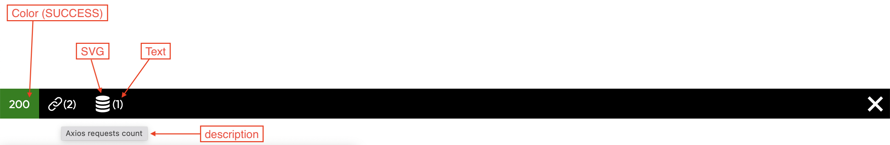
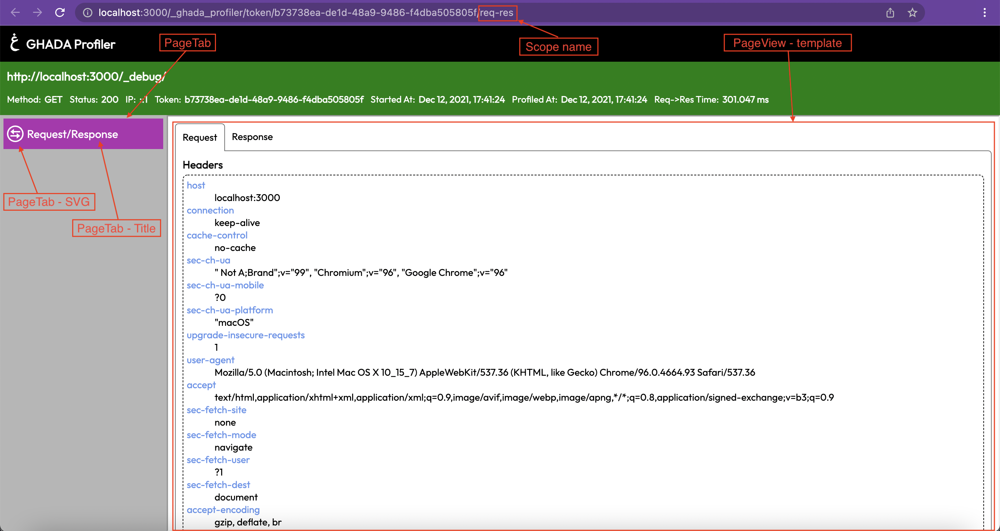
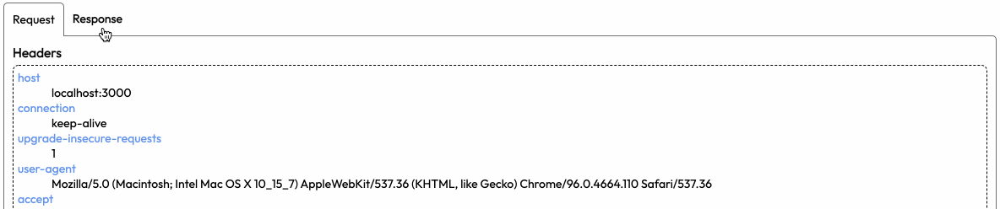
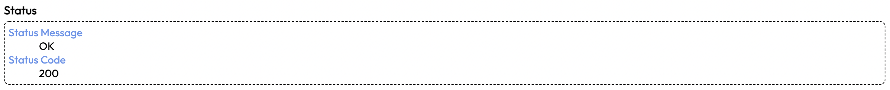
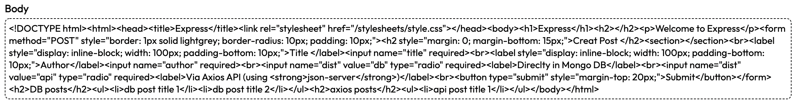
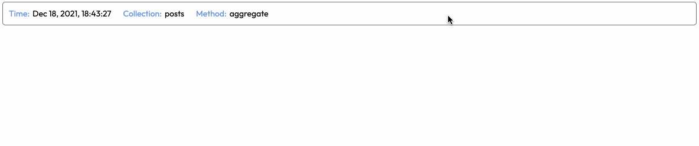

# Create Your Own Ghada Express Profiler Scope

The below implementation gives an example of a package written in Typescript and [ejs template engine][URL_ejs].

It is recommended to use [Typescript][URL_typescript] to build your `scope package`. All Ghada Express Profiler `scope packages` are built using Typescript.

You can refer to [Axios Scope Repo][URL_scopes_axios] to check how it was implemented and resemble it.

No let's start with the steps for `scope package` creation:

## 1. Make your package directory

   ```sh
   mkdir mypackage
   cd mypackage
   ```

## 2. Create a nodejs project

   ```sh
   npm init
   ```

## 3. Install required packages

   ```sh
   npm i @ghadautopia/express-profiler on-finished
   ```

   In your `package.json` file, make sure to lock the `@ghadautopia/express-profiler` to the version required for your scope to work. If the user installed your `scope package` while using a mismatched version of `@ghadautopia/express-profiler`, the user will end up with something like the below error

   ```sh
   Error: The scope {"name":"axios","hasToolbarSlot":true,"hasPageView":true} is not instance of ProfilerScope
   ```

   For example, to allow your `scope package` to be used with any `@ghadautopia/express-profiler` version, in your `package.json` the required version for `@ghadautopia/express-profiler` should be `"*"`. Like the below

   ```json
   "dependencies": {
      // ...
      "@ghadautopia/express-profiler": "*",
      // ...
   }
   ```

## 4. Install template engine packages

Install template engine which you will use for rendering the scope view page. Here we are installing ejs but you can install your preferred template engine

   ```sh
   npm i ejs
   ```

## 5. Install specific packages needed for your scope or stream

## 6. Create the project structure as below

   ```dir
   📦mypackage
   ┣ 📂doc
   ┃ ┗ 📂images
   ┃ ┃ ┣ 📜my-img1.png
   ┃ ┃ ┗ 📜my-img2.png
   ┣ 📂src
   ┃ ┣ 📜index.ts
   ┃ ┣ 📜scope.ts
   ┃ ┗ 📜stream.ts
   ┣ 📂views
   ┃ ┣ 📂script
   ┃ ┃ ┗ 📜index.js
   ┃ ┣ 📂styles
   ┃ ┃ ┗ 📜index.css
   ┃ ┗ 📂template
   ┃ ┃ ┗ 📜index.ejs
   ┣ 📜CHANGELOG.md
   ┣ 📜README.md
   ┣ 📜package.json
   ┗ 📜tsconfig.json
   ```

   __Directory Structure Explanation:__

   | dir/file | Eeplanation |
   |----|----------|
   | doc | contains the resources (e.g. images) used in the README.md file |
   | src/index.ts | contains modules you need to expose to be used by the project using your package. At least, you need to expose your package `scope` module which will be added to `Ghada Express Profiler` config `scopes` array prop to enable your scope. For example, in [Axios scope package][URL_scopes_axios], we are exposing the `axiosScope` and the `axiosStreamMiddlware` modules. Those modules should be added to `Ghada Express Profiler` config props `scopes` and `streamMiddlwares` respectively |
   | src/scope.ts | file containing your scope implementation logic |
   | src/stream.ts | file containing your stream implementation logic. This module is __optional__. Required in case your scope needs a new stream to log new data |
   | views | contains views related files. Not required if your scope only renders a `toolbar slot` |
   | views/script/index.js | __optional JS file__ contains the javascript which will run in your scopes page view |
   | views/styles/index.css | __optional CSS file__ contains the CSS styles which will run in your scopes page view |
   | views/template/index.ejs | file containing your HTML template which will be rendered to display the scope page |
   | CHANGELOG.md | the changlog file for this package |
   | README.md | the readme file for this package |
   | package.json | package.json file |
   | tsconfig.json | typescript configuration file |

## 7. Implement your stream (optional)

The stream is responsible for logging data that will be used to render your scope components. It's __only__ required if your scope will use data not already logged by other streams.

Each stream should have a unique name. When creating your stream make sure not to collide with other stream names. Check current stream names below:

| Stream name (__UNIQUE__) | Package | Git repo |
| --- | --- | --- |
| req-res | within profiler | --
| axios | TBD | [here][URL_scopes_axios]
| mongoose | TBD | [here][URL_scopes_mongoose]

The stream implementation should be located in `src/stream.ts`. Check [Axios stream][URL_scopes_axios_stream]

The stream is created via `createStream` helper function. You can import it from `@ghadautopia/express-profiler`

```typescript
import { createStream } from '@ghadautopia/express-profiler';

const myStream = createStream('my-stream-name');
```

The `createStream` will return an instance of `ProfilerStream`. You can use the `ProfilerStream::persist` method to log the required data at any point of time of the request lifecycle. The `persist` method takes 2 arguments:

- The current `Server response`
- Object of the data you want to log

<br/>

__<span style="background: red; color: white; padding: 5px">VERY IMPORTANT</span>__

__MAKE SURE TO CLEAN UP AFTER LOGGING THE REQUIRED DATA. YOU CAN DO THIS BY USING THE [ON-FINISHED][URL_ON-FINISHED] PACKAGE TO DETECT THAT THE `RESPONSE` HAS BEEN SENT.__

The example below shows how data is being logged by `axios stream`. The `axiosMiddleware` will be exposed to the package user to use it during instantiating `Ghada Express Profiler` in the `streamMiddlewares` config array.

In this middleware, we are making use of axios interceptors and `persisting` every response generated by axios. Then, we are using the `onFinished` method on the `Server response` to destroy the interceptor, because at this point we are sure that the `Server response` was sent to the client. Finally, we use `next()` to let the request pass through.

```typescript
export const axiosStreamMiddleware: (axios: AxiosInstance) => RequestHandler = (axios: AxiosInstance) => {
    return (req, res, next) => {

        const intercept = axios.interceptors.response.use(async function (response) {
            await axiosStream.presist(res, response);
            return response;
        }, async function (error) {
            await axiosStream.presist(res, { ...error.response, error });
            return Promise.reject(error);
        });

        onFinished(res, () => axios.interceptors.response.eject(intercept));

        next();
    }
}
```

## 8. Implement your scope

The scope mainly responsible for rendering:

- The scope toolbar slot in `Ghada Express Profiler` toolbar (__optional__)

### toolbar image



- The scope pageview (__optional__)

### pageview image



The scope should be located in `src/scope.ts`. Check [Axios scope][URL_scopes_axios_scope]

The scope is created via `createScope` helper function. You can import it from `@ghadautopia/express-profiler`

```typescript
import { createScope } from '@ghadautopia/express-profiler';

export const myScope = createScope(props);
```

__createScope function props:__
| prop | type | desctiption |
| ---- | ---- | ----------- |
| name | string | The name of your scope. It will be used in scope url to direct to the scope's page view|
| getToolbarSlot | (__optional__) async (streamsData) => ToolbarSlotData | <ul><li>Required if your scope will render a [toolbar slot][REF-IMG_toolbar]</li><li>Its argument is a Map with all the available [streams data][REF_streamsdata-structure]</li><li>Its should return a Promise of [ToolbarSlotData object][REF_toolbarSlotData-props]</li></ul> |
| getPageTab | (__optional__) async (streamsData) => PageTabData | <ul><li>Required if your scope will render a [pageview][REF-IMG_pageview]</li><li>It renders the scope tab in the side nav</li><li>Its argument is a Map with all the available [streams data][REF_streamsdata-structure]</li><li>It should return a Promise of [PageTabData object][REF_pagetabdata-props]</ul>|
| getPageView | (__optional__) async (streamsData>, profilerViewsDir: string) => PageViewData | <ul><li>Required if your scope will render a [pageview][REF-IMG_pageview]</li><li>It renders the pageview in scopes page</li><li>Its first argument is a Map with all the available [streams data][REF_streamsdata-structure]</li><li>Its second argument is a string containing the directory where the views are located in `@ghadautopia/express-profiler` package in case you wanted to reuse any [ejs mixin][REF_ejs-mixins] from there</li><li>It should return a Promise of [PageViewData object][REF_pageviewdata-props]</li></ul>|

### Scope data types

- #### streamsData structure

   ```typescript
   Map {
      'stream_name' => [
         {  
            token: string; // profiler token id
            stream: string; // stream name
            time: string; // time of logging (epoch)
            data: any; // raw logged data
         }
      ]
   }
   ```

- #### [ToolbarSlotData props][REF-IMG_toolbar]
  
   | prop | type | description |
   | --- | --- | --- |
   | text | string | text rendered in the toolbar slot|
   | description | string (optional) | tooltip text when the user hovers over the slot |
   | svg | string (optional) | svg image code as a string |
   | color | ProfilerColor enum (optional) | Background color of the slot |

- #### [PageTabData props][REF-IMG_pageview]

   | prop | type | description |
   | --- | --- | --- |
   | svg | string (optional) | tab svg |
   | title | string | tab text |

- #### [PageViewData props][REF-IMG_pageview]

   | prop | type | description |
   | --- | --- | --- |
   | template | string | string of html tags to render the page view |
   | styles | string (optional) | string of CSS styles used in page view |
   | script | string (optional) | string of JS script used in page view |

### Global CSS classes

The below css classes are available. You can use them whenever you want

| css class | description | example |example result |
| --- | --- | --- | --- |
| container | wrapper |
| bg-default</br>bg-danger</br>bg-success<br/>bg-warning<br/>bg-info<br/>bg-info-dark | background colors|
|color-white<br/>color-default<br/>color-danger<br/>color-success<br/>color-warning<br/>color-info<br/>color-info-dark| colors |
| gp-tabs<br/>gp-tabs__links<br/>gp-tabs__link<br/>gp-tabs__link--active<br/>gp-tabs__content| create contents which can be switched by tabs | ```<section class="gp-tabs">```<br/>```<nav class="gp-tabs__links">```<br/>```<h4><a href="#" class="gp-tabs__link">First tab</a></h4>```<br/>```<h4><a href="#" class="gp-tabs__link">Second tab</a></h4>```<br/>```</nav>```<br/>```<section class="gp-tabs__content">Content of first tab</section>```<br/>```<section class="gp-tabs__content">Content of second tab</section>```<br/>```</section>``` |  |
|gp-el<br/>gp-el__header<br/>gp-el__content| default element | ```<article class="gp-el"><h3 class="gp-el__header">Title</h3><dl class="gp-el__content"><dt>key 1</dt><dd>value 1</dd><dt>key 2</dt><dd>value 2</dd></dl></article>``` <br/>OR<br/> ```<article class="gp-el"><h3 class="gp-el__header">Title</h3><dl class="gp-el__content">Content</article>``` |  
|gp-el-collapse<br/>gp-el-collapse--expanded<br/>gp-el-collapse__header<br/>gp-el-collapse__content | collapsible element | ```<article class="gp-el-collapse"><header class="gp-el-collapse__header" role="heading">Header</header><div class="gp-el-collapse__content">Content</div></article>``` | 

### EJS Mixins

If you are using `ejs` to implement your templates. Then you can benefit from `Ghada Express Profiler` mixins below

| mixin | description |
| --- | --- |
|[formatTimestamp][URL_mixin_format-timestamp]| format valid date string |
|[getReqStartTime][URL_mixin_get-req-start-time]| return formatted request start time |
|[getReqUrl][URL_mixin_get-req-url]| return the request full url |
|[getResStatus][URL_mixin_get-res-status]| return color status of the response `default`, `danger`, `warning`, `info` or `success`. Used with classes `bg-{{ color }}` or `color-{{ color }}` to style HTML elements|
|[getScopeUrl][URL_mixin_get-scope-url]| return url for the scope's page view |

In order to use those mixins, you need to pass the `profilerViewsDir` paramter (the second argument of the `getPageView` function) to your view template. Then you can include any mixin in your template as shown below. check [Axios scope][URL_scopes_axios_scope]

```ejs
<%- include(`${profilerViewsDir}/mixins/format-timestamp.ejs`) -%>

<%= formatTimestamp(time) %>
```

```ejs
<%- include(`${profilerViewsDir}/mixins/get-res-status.ejs`) -%>

<section class="color-<%= getResStatus({ statusCode: res.status }) %>">
   <%= res.status %>
</section>
```

## 9. README

Please add a __README.md__ file to your package. You can refer to [Axios scope readme][URL_scopes_axios_readme]

## Helpers you can use from `@ghadautopia-express-profiler`

- __createScope__: Function to create new scope
- __createStream__: Function to create new stream
- __getTokenFromRes__: Function to get the profiler token assigned to server response
- __ProfilerError__: Class of Profiler error

## Types you can use from `@ghadautopia-express-profiler`

- __ProfilerColor__: An enum to identify background color of toolbar slot

[//]: # (reference links)

   [URL_scopes_axios]: <https://github.com/ghadautopia/express-profiler-axios>
   [URL_scopes_mongoose]: <https://github.com/ghadautopia/express-profiler-mongoose>
   [URL_scopes_axios_readme]: <https://github.com/ghadautopia/express-profiler-axios/README.md>
   [URL_scopes_axios_scope]: <https://github.com/ghadautopia/express-profiler-axios/blob/main/src/scope.ts>
   [URL_scopes_axios_stream]: <https://github.com/ghadautopia/express-profiler-axios/blob/main/src/stream.ts>
   [URL_ejs]: <https://ejs.co/>
   [URL_typescript]: <https://www.typescriptlang.org/>
   [URL_on-finished]: <https://www.npmjs.com/package/on-finished>

   [URL_mixin_format-timestamp]: <https://github.com/ghadautopia/express-profiler/blob/main/views/mixins/format-timestamp.ejs>
   [URL_mixin_get-req-start-time]: <https://github.com/ghadautopia/express-profiler/blob/main/views/mixins/get-req-start-time.ejs>
   [URL_mixin_get-req-url]: <https://github.com/ghadautopia/express-profiler/blob/main/views/mixins/get-req-url.ejs>
   [URL_mixin_get-res-status]: <https://github.com/ghadautopia/express-profiler/blob/main/views/mixins/get-res-status.ejs>
   [URL_mixin_get-scope-url]: <https://github.com/ghadautopia/express-profiler/blob/main/views/mixins/get-scope-url.ejs>

   [REF-IMG_toolbar]: <#toolbar-image>
   [REF-IMG_pageview]: <#pageview-image>
   [REF_streamsdata-structure]: <#streamsdata-structure>
   [REF_toolbarslotdata-props]: <#toolbarslotdata-props>
   [REF_pagetabdata-props]: <#pagetabdata-props>
   [REF_pageviewdata-props]: <#pageviewdata-props>
   [REF_ejs-mixins]: <#ejs-mixins>
